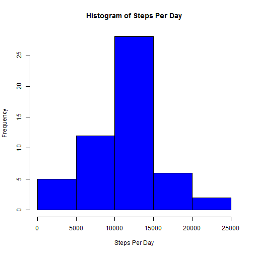
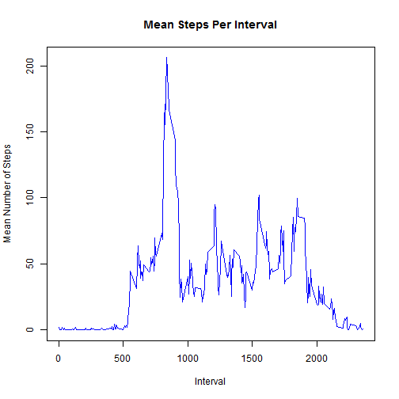
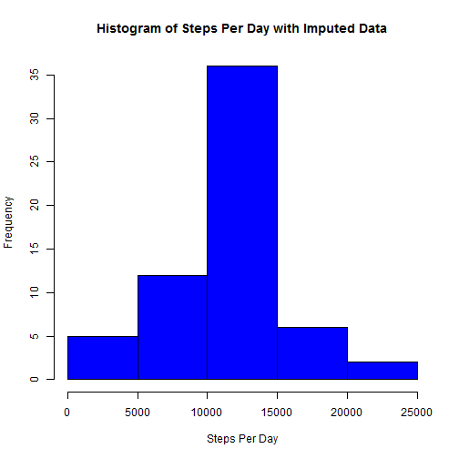

# Reproducible Research: Peer Assessment 1


## Loading and preprocessing the data

First, let's get the data and check the dimensions of the data frame.


```r
setwd("C:/Users/Owner/Documents/DataScienceCertification/RepoResearch/peer1/RepData_PeerAssessment1")

df1<-read.csv(unz("activity.zip", "activity.csv"), colClasses=c("numeric","Date","numeric"))

# Check Dim
dim(df1)
```

```
## [1] 17568     3
```

## What is mean total number of steps taken per day?

Now we plot a histogram of the total number of steps taken per day and   
calculate the associated mean and median... 


```r
dfStepsPerDay<-aggregate(steps~date,data=df1,sum)
myMean<-summary(dfStepsPerDay$steps)[4]
myMedian<-summary(dfStepsPerDay$steps)[3]
summary(dfStepsPerDay$steps)
```

```
##    Min. 1st Qu.  Median    Mean 3rd Qu.    Max. 
##      41    8840   10800   10800   13300   21200
```

```r
hist(dfStepsPerDay$steps,xlab="Steps Per Day",main="Histogram of Steps Per Day",col="blue")
```

 

The mean number of steps per day is 1.08 &times; 10<sup>4</sup>.  
The median number of steps per day is 1.08 &times; 10<sup>4</sup>.


## What is the average daily activity pattern?

Here we simply calculate the means number of steps for each time interval, generate  
a plot, and find the interval with the highest mean...


```r
dfStepsPerInterval<-aggregate(steps~interval,data=df1,mean)
maxStepsInterval<-dfStepsPerInterval[dfStepsPerInterval$steps==max(dfStepsPerInterval$steps),]
maxInterval<-maxStepsInterval[1]
maxSteps<-round(maxStepsInterval[2],0)


plot(dfStepsPerInterval$steps~dfStepsPerInterval$interval,type="l",col="blue",
     ylab="Mean Number of Steps",xlab="Interval",main="Mean Steps Per Interval")
```

 

The 5-minute interval, on average across all the days in the dataset, containing the maximum number of steps is interval 835.   
The mean number of steps in this interval is 206.


## Imputing missing values

Time to deal with missing values (NA).  First, how many are there?


```r
nMissing<-sum(is.na(df1))
```

The number of missing values in the dataset = 2304.  

  
Now impute missing values - keeping it simple by imputing means for each interval...  
Include a quick view of the data sets and dimensions to ensure successful imputation


```r
dfMeans<-aggregate(steps~interval,data=df1,mean,rm.NA=TRUE)

df1NA<-df1[is.na(df1$steps),]
df2<-merge(df1NA[,c("date","interval")],dfMeans)
df3<-rbind(df1,df2)
df4<-df3[complete.cases(df3),]
df4<-df4[order(df4$date, df4$interval),]

head(df1)
```

```
##   steps       date interval
## 1    NA 2012-10-01        0
## 2    NA 2012-10-01        5
## 3    NA 2012-10-01       10
## 4    NA 2012-10-01       15
## 5    NA 2012-10-01       20
## 6    NA 2012-10-01       25
```

```r
head(df4)
```

```
##         steps       date interval
## 17569 1.71698 2012-10-01        0
## 17578 0.33962 2012-10-01        5
## 17585 0.13208 2012-10-01       10
## 17597 0.15094 2012-10-01       15
## 17601 0.07547 2012-10-01       20
## 17613 2.09434 2012-10-01       25
```

```r
dim(df1)
```

```
## [1] 17568     3
```

```r
dim(df4)
```

```
## [1] 17568     3
```

After successfully imputing missing data, we plot a histogram of total steps per day


```r
dfStepsPerDayImputed<-aggregate(steps~date,data=df4,sum)
hist(dfStepsPerDayImputed$steps,xlab="Steps Per Day",main="Histogram of Steps Per Day with Imputed Data",col="blue")
```

 

A quick check with the summary function suggests that imputing data changed the summary statistics for total steps per day very little.  Here is a summary on the original data...


```r
summary(dfStepsPerDay$steps)
```

```
##    Min. 1st Qu.  Median    Mean 3rd Qu.    Max. 
##      41    8840   10800   10800   13300   21200
```


And here is a summary on the imputed data set...


```r
summary(dfStepsPerDayImputed$steps)
```

```
##    Min. 1st Qu.  Median    Mean 3rd Qu.    Max. 
##      41    9820   10800   10800   12800   21200
```

```r
myMeanImputed<-summary(dfStepsPerDayImputed$steps)[4]
myMedianImputed<-summary(dfStepsPerDayImputed$steps)[3]
```

Recall, the mean number of steps per day in the orignal data was 1.08 &times; 10<sup>4</sup>.  
The mean number of steps per day in the imputed data is 1.08 &times; 10<sup>4</sup>.  

Recall, the median number of steps per day in the orignal data was 1.08 &times; 10<sup>4</sup>.  
The median number of steps per day in the imputed data is 1.08 &times; 10<sup>4</sup>.  

Therefore, imputing the data did not change the average total steps per day.  


## Are there differences in activity patterns between weekdays and weekends?
